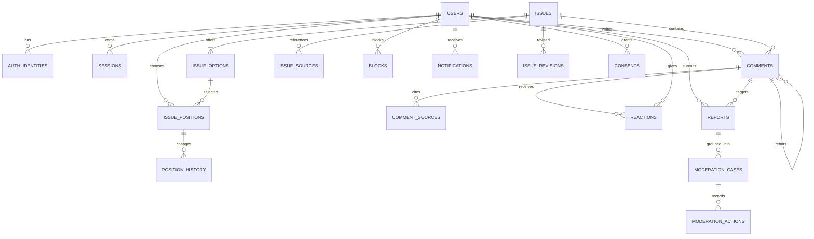
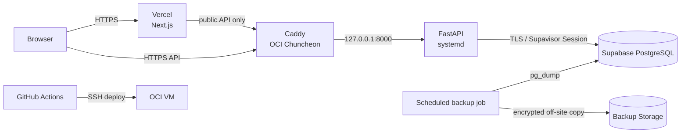

# 아니근데 서비스 전체 설계서

> 뉴스가 아니라 쟁점을 읽고, 내 입장을 정하고, 서로의 의견에 `근데`를 다는 정치·사회 이슈 토론 서비스

- 문서 상태: MVP 개발 기준선
- 작성일: 2026-08-18
- 대상: 제품, 디자인, 프론트엔드, 백엔드, 운영·모더레이션 담당자
- 확정 스택: Next.js + TypeScript + Tailwind CSS / FastAPI / Supabase PostgreSQL / Vercel / OCI 춘천 A1.Flex
- 법률 주의: 이 문서는 제품·기술 설계를 위한 위험 식별 자료이며 개별 사안에 대한 법률의견이 아니다. 공개 출시 전 서비스 화면, 약관, 개인정보 처리, 기사 수집·배열 방식, 선거기간 운영정책을 국내 미디어·개인정보 분야 전문가에게 검토받는다.

---

## 목차

1. [문서의 목적과 결정 요약](#1-문서의-목적과-결정-요약)
2. [서비스 비전과 핵심 가치](#2-서비스-비전과-핵심-가치)
3. [제품 원칙과 용어](#3-제품-원칙과-용어)
4. [대상 사용자와 핵심 사용자 플로우](#4-대상-사용자와-핵심-사용자-플로우)
5. [MVP 범위](#5-mvp-범위)
6. [주요 화면 및 UX 명세](#6-주요-화면-및-ux-명세)
7. [핵심 인터랙션 명세](#7-핵심-인터랙션-명세)
8. [바이럴 루프와 성장 측정](#8-바이럴-루프와-성장-측정)
9. [쟁점·뉴스 소스 생성 및 관리자 워크플로](#9-쟁점뉴스-소스-생성-및-관리자-워크플로)
10. [데이터 모델과 ERD](#10-데이터-모델과-erd)
11. [API 설계](#11-api-설계)
12. [인증과 권한](#12-인증과-권한)
13. [모더레이션·신고·임시조치](#13-모더레이션신고임시조치)
14. [법적 고려사항과 출시 게이트](#14-법적-고려사항과-출시-게이트)
15. [보안 설계](#15-보안-설계)
16. [인프라 아키텍처](#16-인프라-아키텍처)
17. [OCI 배포 구조와 운영 절차](#17-oci-배포-구조와-운영-절차)
18. [Supabase 연결과 데이터 운영](#18-supabase-연결과-데이터-운영)
19. [로깅·모니터링·백업](#19-로깅모니터링백업)
20. [CI/CD](#20-cicd)
21. [권장 디렉터리 구조](#21-권장-디렉터리-구조)
22. [테스트 전략과 완료 기준](#22-테스트-전략과-완료-기준)
23. [단계별 개발 로드맵](#23-단계별-개발-로드맵)
24. [향후 확장 계획](#24-향후-확장-계획)
25. [결정 대기 항목과 출시 체크리스트](#25-결정-대기-항목과-출시-체크리스트)
26. [공식 참고자료](#26-공식-참고자료)

---

## 1. 문서의 목적과 결정 요약

### 1.1 목적

이 문서는 `아니근데` MVP를 실제로 구현하고 공개 운영하기 위한 단일 기준선이다. 제품이 무엇인지뿐 아니라 데이터 구조, API, 배포, 운영, 법적 위험 대응까지 같은 언어로 연결한다.

### 1.2 확정된 방향

| 항목 | 결정 |
|---|---|
| 서비스명 | `아니근데` |
| 정체성 | 뉴스 서비스가 아닌 정치·사회 **쟁점 토론 서비스** |
| 콘텐츠 단위 | 기사가 아니라 관리자가 만든 `쟁점(Issue)` |
| 핵심 행동 | 일반 답글 대신 반론을 의미하는 `근데` |
| 의견 평가 | `일리있음`, `생각바뀜`; `출처좋음`은 MVP 후순위 후보 |
| 투표 UX | 타인의 결과를 보기 전에 자신의 입장을 선택 |
| 뉴스 사용 | 기사 전문·사진을 저장하지 않고 제목·언론사·URL을 참고자료로 제공 |
| 쟁점 발행 | MVP에서는 관리자 작성·검수·발행. 자동 수집·자동 게시 없음 |
| 프론트엔드 | Next.js, TypeScript, Tailwind CSS, Vercel |
| 백엔드 | FastAPI, SQLAlchemy 2, Alembic, Pydantic, psycopg 3 |
| API 서버 | OCI 춘천 Always Free `VM.Standard.A1.Flex`, 1 OCPU, 6GB RAM |
| OS/디스크 | Ubuntu 24.04 Minimal aarch64, 50GB boot volume |
| VM 프로세스 | Caddy + FastAPI만 운영. PostgreSQL·Redis는 VM에 설치하지 않음 |
| 데이터베이스 | Supabase PostgreSQL. 브라우저에서 DB 직접 접근 금지 |
| 배포 방식 | Caddy → `127.0.0.1:8000` FastAPI, systemd 관리 |
| 초기 구조 | 모노레포 권장 |

### 1.3 MVP 성공의 정의

MVP 성공은 페이지뷰가 아니라 다음 행동 사슬이 반복되는 상태다.

```text
쟁점 진입 → 입장 선택 → 의견 읽기/작성 → 근데 또는 생각바뀜 → 공유 → 신규 참여
```

초기 판단 지표는 다음과 같다.

- 쟁점 상세 방문 대비 입장 선택률
- 입장 선택 후 의견 작성 또는 `근데` 작성률
- 원 의견 1개당 유효한 `근데` 수
- `생각바뀜`이 발생한 토론 스레드 비율
- 공유 링크 방문 대비 신규 입장 선택률
- 신고 1건당 최초 조치 시간과 최종 처리 시간
- 7일 내 동일 쟁점 재방문 및 다른 쟁점 참여율

---

## 2. 서비스 비전과 핵심 가치

### 2.1 한 문장 비전

> 세상 모든 의견에 안전하고 근거 있는 `근데`를 붙일 수 있는 공간.

### 2.2 해결하려는 문제

기존 뉴스 댓글과 정치 커뮤니티는 다음 문제를 반복한다.

- 기사 소비와 감정적 반응이 중심이고 실제 쟁점이 흐려진다.
- 좋아요·싫어요가 진영 규모를 보여줄 뿐 설득의 질을 보여주지 않는다.
- 원 의견, 반론, 재반론의 관계가 쉽게 무너진다.
- 사실 주장과 의견이 섞이고 출처가 사라진다.
- 논쟁에서 이겼다는 보상은 있지만 생각이 바뀌었다는 보상은 없다.

### 2.3 핵심 가치

1. **쟁점 우선**: 뉴스는 참고자료이고 쟁점이 화면과 URL의 중심이다.
2. **선택 전 독립성**: 사용자가 먼저 생각한 뒤 집단 결과를 본다.
3. **반론의 구조화**: `근데`는 감정 버튼이 아니라 특정 의견을 향한 새 글이다.
4. **설득의 보상**: `생각바뀜`을 가장 가치 있는 반응으로 취급한다.
5. **근거의 가시성**: 사실 주장은 출처를 붙이기 쉽게 만들고, 출처의 성격을 표시한다.
6. **다름의 안전**: 반대 의견을 노출하되 혐오·위협·신상털이·허위사실 유통을 방치하지 않는다.
7. **개인정보 최소화**: 정치성향 점수나 정당 선호 프로필을 만들지 않는다.

### 2.4 하지 않을 것

- 기사 전문, 기사 이미지, 유료기사 본문을 복제·저장하지 않는다.
- “진보 74% / 보수 26%” 같은 사용자 정치성향 점수를 생성하지 않는다.
- AI가 쟁점을 자동 게시하지 않는다.
- 익명성을 이유로 무제한·무추적 게시를 허용하지 않는다.
- 쟁점의 복잡성을 언제나 찬반 둘로만 환원하지 않는다.
- 광고주·정당·후보자에게 일반 콘텐츠와 구분되지 않는 노출을 판매하지 않는다.

---

## 3. 제품 원칙과 용어

### 3.1 제품 내 핵심 용어

| 시스템 명칭 | 사용자에게 보이는 말 | 정의 |
|---|---|---|
| Issue | 쟁점 | 하나의 명확한 질문, 중립적 브리프, 참고자료를 묶은 토론 단위 |
| Position | 내 생각 | 쟁점에 대한 사용자의 선택. 쟁점별 선택지 집합은 2~4개 |
| Argument | 의견 | 쟁점에 직접 작성하는 최상위 주장 |
| Rebuttal | 근데 | 특정 의견에 대한 반론 또는 보완 의견. 별도 reaction이 아닌 댓글 노드 |
| MAKES_SENSE | 일리있음 | 전부 동의하지 않더라도 논리나 관점에 가치가 있다는 평가 |
| CHANGED_MIND | 생각바뀜 | 해당 글로 인해 자신의 판단이 의미 있게 달라졌다는 평가 |
| Source | 참고자료 | 쟁점을 이해하기 위한 1차 자료·언론 기사·통계·연구 링크 |
| Temporary Measure | 임시조치 | 권리침해 다툼 중 최대 30일 이내 접근을 임시 차단하는 운영 상태 |

### 3.2 문구 원칙

- `댓글 달기` 대신 `근데 하나 할게`
- `답글 12개` 대신 `근데 12개`
- `좋아요` 대신 `일리있음`
- `찬반 투표` 대신 `아니근데, 너는?`
- `공유하기`의 기본 문구는 `아니근데 이건 네 생각 궁금함`
- 모욕을 유도하는 `반박 못 하지?`, `참교육` 같은 카피는 사용하지 않는다.

### 3.3 쟁점 선택지 모델

고정된 `찬성/반대/모르겠음` enum만 사용하지 않는다. 각 쟁점이 2~4개의 선택지를 가진다.

예시:

```text
질문: 주 4.5일제를 법제화해야 할까?
- 전국적으로 도입해야 한다
- 업종별로 시범 도입해야 한다
- 법제화에 반대한다
- 아직 판단하기 어렵다
```

선택지별 정렬 순서와 중립적인 색을 관리자가 정한다. 색상은 정당의 대표색과 자동 연결하지 않는다.

---

## 4. 대상 사용자와 핵심 사용자 플로우

### 4.1 주요 사용자

| 사용자 | 필요 | 제품 대응 |
|---|---|---|
| 가벼운 참여자 | 짧은 시간에 쟁점을 이해하고 내 생각 표시 | 짧은 브리프, 선택 후 결과 공개 |
| 토론 참여자 | 특정 주장에 반론하고 근거 제시 | `근데`, 출처 첨부, 스레드 |
| 관찰자 | 양쪽 핵심 논거를 빠르게 비교 | 입장 필터, 일리있음/생각바뀜 정렬 |
| 공유 유입자 | 친구가 보낸 질문에 답하고 결과 확인 | 공유 컨텍스트, 입장 선택 게이트 |
| 운영자 | 쟁점 발행, 신고 처리, 법적 요청 대응 | 관리자 워크플로와 감사 로그 |

### 4.2 비회원 플로우

```text
홈/공유 링크 진입
  → 쟁점 질문·브리프·참고자료 확인
  → 비로그인 상태에서 입장 선택
  → 선택은 임시 보관하고 로그인 안내
  → 로그인 완료
  → 기존 선택을 자동 확정하고 집계 반영
  → 집계 결과와 의견 피드 공개
```

조작 방지와 민감정보 동의 기록을 위해 **확정 입장 저장·글쓰기·반응은 로그인 사용자만** 허용한다. 비회원도 선택지를 누를 수 있지만 로그인 전 선택은 참여 결과에 집계하지 않는다. 로그인 완료 후 같은 선택을 다시 요구하지 않고 임시 선택을 자동 확정한다. 비회원은 쟁점과 공개 의견을 읽을 수 있지만, 결과 분포는 입장 선택 전에는 숨기거나 범주형 문구만 노출한다.

### 4.3 회원의 핵심 플로우

```text
쟁점 진입
  → 브리프와 출처 확인
  → 내 입장 선택 + 민감정보 처리 안내/동의
  → 결과 확인
  → 입장별 핵심 의견 탐색
  → 원 의견 작성 또는 특정 의견에 근데 작성
  → 일리있음/생각바뀜
  → 결과 카드 공유
  → 알림을 통해 스레드 재방문
```

### 4.4 생각 변경 플로우

`생각바뀜`은 단순 칭찬이 아니다.

1. 사용자가 반대·다른 선택지의 의견을 읽는다.
2. `생각바뀜`을 누른다.
3. 짧은 확인창에서 “이 의견이 판단에 영향을 주었나요?”를 확인한다.
4. 원하면 현재 입장을 새 선택지로 변경한다.
5. 시스템은 반응과 입장 변경을 별개 이벤트로 저장한다.
6. 작성자에게는 상대의 닉네임을 과도하게 노출하지 않고 “누군가 이 의견을 보고 생각을 바꿨어요”라고 알린다.

---

## 5. MVP 범위

### 5.1 포함

- 소셜 로그인 1~2종과 세션 관리
- 닉네임 기반 프로필
- 쟁점 목록·상세·카테고리·상태
- 쟁점별 2~4개 입장 선택지
- 입장 선택 전 결과 숨김
- 원 의견 작성·수정·자진 삭제
- 특정 의견에 `근데` 작성
- `일리있음`, `생각바뀜`
- 의견별 출처 URL 0~3개 첨부
- 신고·차단·관리자 숨김·임시조치·이의제기
- 관리자 쟁점 초안·검수·예약 발행·종료
- 참고자료 링크 관리
- 기본 알림함
- 공유 링크와 동적 Open Graph 카드
- 구조화 로그, 상태 확인, 수동 복구가 검증된 DB 백업

### 5.2 제외

- 사용자 간 DM
- 사용자 직접 쟁점 생성
- 실시간 채팅
- 기사 전문 크롤링·저장·재배포
- AI 자동 게시, 자동 사실판정
- 팔로워 그래프, 정당·정치인 팬 페이지
- 개인별 정치성향·이념점수
- 광고·후원·유료 정치 캠페인 계정
- 네이티브 앱
- Elasticsearch, Redis, 메시지 큐
- 무제한 깊이의 화면 중첩

### 5.3 MVP 후순위

- `출처좋음` 반응
- 쟁점 후보 수집기와 AI 브리프 초안
- 이메일·푸시 알림
- 활동 배지(근거왕, 설득왕)
- 전문 검색
- 쟁점 제안과 시민 패널

---

## 6. 주요 화면 및 UX 명세

### 6.1 `/` 홈

구성 순서:

1. 브랜드와 한 문장 설명
2. `지금 가장 말 많은 쟁점` 1개
3. 최신·활발·곧 마감 쟁점 카드
4. 카테고리 필터
5. 운영 원칙 및 출처 정책 링크

쟁점 카드 필수 필드:

- 질문
- 2~3줄 이내 브리프
- 카테고리
- 참여자 수
- `근데` 수
- 발행 시각/마감 시각
- 참고자료 수

**선택 전에는 선택지별 비율을 카드에 표시하지 않는다.** `1,284명 참여`처럼 총량만 표시한다.

### 6.2 `/issues/[slug]` 쟁점 상세

상단:

- 쟁점 상태(`토론 중`, `종료`, `정정됨`)
- 질문
- 브리프
- 최종 업데이트 시각과 변경 이력
- 출처 목록: 1차 자료 우선, 언론 기사, 통계·연구

입장 선택 전:

- 선택지 버튼
- “다른 사람 결과는 선택 후 공개됩니다” 안내
- 정치적 견해 관련 데이터 처리 안내 링크

입장 선택 후:

- 전체 분포(표본 수와 집계 시각 포함)
- 내 선택과 변경 버튼
- 입장별 의견 필터
- 정렬: `논의 중`, `일리있음`, `생각바뀜`, `최신`
- 의견 작성 CTA

집계에는 `대한민국의 생각` 같은 표현을 쓰지 않는다. 모집단 대표성이 없고 소셜 로그인 제공자별 계정이 동일인에게 속할 수 있으므로 `회원 계정 1,284개의 선택`이라고 표기한다.

### 6.3 의견 카드

필수 표시:

- 익명 닉네임과 해당 쟁점에서 공개하기로 한 입장
- 본문
- 수정 여부
- 출처 링크와 도메인
- `일리있음 n`, `생각바뀜 n`, `근데 n`
- 신고 메뉴

숨김·삭제 상태는 이유를 구분한다.

- 작성자 삭제: `작성자가 삭제한 의견입니다.`
- 운영정책 숨김: `운영정책 위반으로 숨겨진 의견입니다.`
- 임시조치: `권리침해 신고에 따라 임시로 접근이 제한되었습니다.`

### 6.4 `/threads/[commentId]` 토론 스레드

- 원 의견에서 현재 노드까지의 문맥 표시
- 현재 노드의 직접 `근데` 목록
- 화면 중첩은 최대 2단계; 이후는 스레드 페이지에서 평면적인 계층 목록으로 표시
- 서버 데이터 모델은 더 깊은 관계를 지원하되 MVP 작성 깊이는 최대 5로 제한
- 차단한 사용자의 내용은 기본 접기

### 6.5 `/me`

- 참여한 쟁점
- 내 입장과 변경 이력 요약
- 내가 쓴 의견·근데
- 받은 `일리있음`·`생각바뀜`
- 내 신고·권리침해 요청 상태
- 계정·개인정보 다운로드/삭제

정치성향을 요약하거나 시각화하지 않는다.

### 6.6 `/notifications`

MVP 알림 유형:

- 내 의견에 `근데`
- 내 의견에 `생각바뀜`
- 내가 참여한 스레드의 후속 반론
- 신고·임시조치·이의제기 결과
- 참여 쟁점의 브리프 정정

### 6.7 `/admin`

- 대시보드: 미처리 신고, 고위험 신고, 발행 대기 쟁점, 시스템 상태
- 쟁점 편집기
- 출처 검수기
- 신고·권리침해 요청 큐
- 사용자 제재
- 감사 로그
- 선거 모드 설정

관리자 페이지는 검색엔진 차단만으로 보호하지 않는다. 서버 측 역할 검증과 MFA를 적용한다.

---

## 7. 핵심 인터랙션 명세

### 7.1 `근데`

정의: 특정 의견을 대상으로 작성되는 독립적인 반론·보완 의견이다.

규칙:

- `parent_id`가 있는 comment로 저장한다.
- 대상 의견과 같은 쟁점에만 작성할 수 있다.
- 빈 본문, 리액션만 있는 `근데`는 허용하지 않는다.
- 최소 10자, 최대 2,000자(정책 링크·인용 제외)로 시작한다.
- 작성자의 현재 입장을 스냅샷으로 보관하되 화면에는 현재 정책에 따라 공개한다.
- 부모 글이 숨겨져도 법적·감사 목적의 관계는 유지한다.
- 동일 사용자가 짧은 시간에 같은 부모에 반복 작성하지 못하도록 제한한다.

### 7.2 `일리있음`

정의: 완전한 동의가 아니라 논리, 근거 또는 관점에 가치가 있음을 나타낸다.

규칙:

- 사용자당 의견별 1회 토글.
- 자기 글에는 누를 수 없다.
- 취소 가능.
- 정렬 신호로 사용하되 작성자 영향력 점수의 유일한 기준으로 사용하지 않는다.
- 비정상적인 상호 반응 집단을 탐지할 수 있도록 이벤트 로그를 남긴다.

### 7.3 `생각바뀜`

정의: 해당 의견이 사용자의 판단을 유의미하게 바꾸었음을 나타내는 최상위 반응이다.

규칙:

- 사용자당 의견별 1회.
- 자기 글에는 누를 수 없다.
- 확인 단계가 필요하다.
- 취소할 수 있으나 이력은 남긴다.
- 입장 변경을 강제하지 않는다.
- 공개 집계에는 최소 인원 기준을 둘 수 있다.
- 알림에 반응자의 정치적 입장을 노출하지 않는다.

### 7.4 입장 선택과 변경

- 쟁점당 활성 입장은 하나다.
- 변경 횟수는 제한하지 않되 남용 방지를 위해 짧은 쿨다운을 둘 수 있다.
- `position_history`에 이전·이후 선택과 시각을 기록한다.
- 공개 통계는 현재 활성 입장만 센다.
- 과거 의견에는 작성 당시 입장 스냅샷을 유지한다.
- 사용자가 탈퇴하면 법적 보존 필요분을 제외하고 계정 연결을 제거하거나 익명화한다.

### 7.5 출처 첨부

- 의견당 최대 3개 URL.
- `https`만 허용한다.
- 서버가 URL을 정규화하고 위험한 scheme과 사설 네트워크 주소를 거부한다.
- 서버가 외부 페이지 본문을 자동 수집하지 않는다.
- OG 미리보기 수집은 별도 SSRF 방어가 준비되기 전까지 비활성화한다.
- 사용자는 링크 유형을 `공식자료`, `언론기사`, `통계/연구`, `기타` 중 선택할 수 있다.

---

## 8. 바이럴 루프와 성장 측정

### 8.1 기본 루프

```text
입장 선택
  → 결과 공개
  → 개인화된 공유 카드 생성
  → 친구가 링크로 진입
  → 친구가 결과를 보기 전 입장 선택
  → 결과 비교
  → 의견/근데 작성
  → 다시 공유
```

### 8.2 공유 카드

기본 문구:

```text
아니근데
“주 4.5일제를 법제화해야 할까?”

나는: 업종별 시범 도입
회원 계정 1,284개는 어떻게 골랐을까?

너는?
```

개인정보 원칙:

- 공개 링크에 사용자 ID, 이메일, 세션 토큰을 넣지 않는다.
- 공유자가 입장 공개를 명시적으로 선택한 경우에만 카드에 입장을 넣는다.
- 기본값은 `질문만 공유`로 둔다.
- 공유 식별자는 만료 가능하고 추측하기 어려운 토큰으로 만든다.

### 8.3 초대 컨텍스트

링크 수신 화면은 “OO님은 이미 선택했습니다” 대신 기본적으로 “누군가 이 쟁점에 당신 생각을 물었습니다”를 사용한다. 공유자의 닉네임 공개는 별도 선택이다.

### 8.4 분석 이벤트

최소 이벤트:

```text
issue_viewed
position_prompt_seen
position_selected
results_revealed
comment_started
comment_published
rebuttal_started
rebuttal_published
reaction_added
position_changed
share_created
share_opened
report_submitted
```

분석 도구에는 원문 댓글, 정치적 선택지 값, 상세 URL 쿼리 등 민감할 수 있는 내용을 전송하지 않는다. 내부 사용자 ID는 분석용 회전 식별자로 치환한다.

---

## 9. 쟁점·뉴스 소스 생성 및 관리자 워크플로

### 9.1 발행 원칙

- 뉴스 API는 쟁점 후보를 발견하는 도구로만 사용하고 최종 발행은 관리자가 수행한다.
- 하루 1~5개 쟁점을 관리자가 작성·검수하여 발행한다.
- 하나의 기사 제목을 그대로 쟁점 제목으로 사용하지 않는다.
- 브리프는 여러 출처와 1차 자료를 바탕으로 자체 작성한다.
- 쟁점 질문은 특정 선택지를 정답처럼 유도하지 않는다.
- 중요한 수치·날짜·발언은 원 출처를 연결한다.
- 최소 2개 출처를 권장하고, 가능한 경우 정부·국회·법원·선관위·통계기관 등 1차 자료를 포함한다.

### 9.2 상태 흐름

```text
DRAFT
  → IN_REVIEW
  → APPROVED
  → SCHEDULED
  → PUBLISHED
  → CLOSED
  → ARCHIVED

검수 반려: IN_REVIEW → DRAFT
중대한 오류: PUBLISHED → CORRECTION_REQUIRED → PUBLISHED 또는 ARCHIVED
```

### 9.3 작성 단계

1. 후보 주제 등록: 사건명, 발생 시점, 관심 이유.
2. 1차 자료 확인: 법안, 판결, 보도자료, 통계 원문.
3. 상이한 관점의 언론·연구 자료 수집.
4. 쟁점 질문 작성.
5. 브리프 작성: 확인된 사실, 아직 불확실한 점, 논쟁의 핵심.
6. 선택지 작성 및 표현 편향 점검.
7. 출처 메타데이터 입력.
8. 선거·명예훼손·저작권·개인정보 위험 태그 지정.
9. 가능하면 2인 검수 후 발행.
10. 발행 후 정정 요청과 출처 변경 감시.

### 9.4 브리프 템플릿

```text
[무슨 일이 있었나]
확인된 사실을 2~4문장으로 설명한다.

[왜 쟁점인가]
서로 다른 선택의 정책적·사회적 효과를 2~4문장으로 설명한다.

[아직 확정되지 않은 것]
예측, 조사 중인 사실, 입법 과정 등 불확실성을 밝힌다.

[참고자료]
1차 자료를 먼저, 이후 관점이 다른 자료를 나열한다.
```

### 9.5 출처 메타데이터

- 제공자/언론사
- 원문 제목
- 원문 URL
- 게시 시각
- 자료 유형
- 1차 자료 여부
- 마지막 링크 확인 시각
- 유료벽 여부
- 발행 중단/삭제 여부

### 9.6 카테고리별 뉴스 후보 수집

네이버 뉴스 검색 API에는 정치·경제·사회 같은 카테고리 파라미터가 없다. 따라서 내부에서 카테고리별 검색어 묶음을 관리하고, 어떤 검색어로 발견됐는지 기록한 뒤 자체 분류한다.

초기 카테고리와 검색어 예시:

| 카테고리 | 검색어 묶음 예시 |
|---|---|
| POLITICS | 국회, 정부, 대통령실, 정당, 선거, 법안, 국정감사 |
| ECONOMY | 금리, 물가, 부동산, 고용, 세금, 기업, 최저임금 |
| SOCIETY | 교육, 노동, 복지, 의료, 범죄, 교통, 재난 |
| TECH | 인공지능, 플랫폼, 개인정보, 게임, 반도체, 과학기술 |
| ENVIRONMENT | 기후, 탄소, 원전, 재생에너지, 미세먼지, 환경 |
| WORLD | 외교, 안보, 국제분쟁, 무역, 미국, 중국, 일본 |

하나의 기사는 여러 검색어와 카테고리에서 발견될 수 있다. 최초 검색어만으로 카테고리를 확정하지 않고 키워드 점수, 제목·요약문 분류와 관리자 판단을 순서대로 적용한다. 관리자는 최종 발행 전에 카테고리를 변경할 수 있다.

수집 주기와 호출 예산:

- 30~60분마다 `sort=date`, 검색어당 최대 100건을 조회한다.
- 6개 카테고리 × 카테고리당 10개 검색어 × 30분 주기라면 하루 약 2,880회 호출이다.
- 네이버 뉴스 검색 API의 하루 25,000회 한도보다 충분히 낮게 시작하고, 빈 결과와 중복이 많은 검색어는 주기를 늦춘다.
- 실패 시 지수 백오프를 적용하고 호출량 임계치에서 자동 중단한다.

수집 항목:

- 검색 카테고리와 검색어
- 원문 제목과 검색 결과 요약문
- 원문 URL과 네이버 뉴스 URL
- 게시 시각과 수집 시각
- 원문 도메인에서 판별한 언론사
- 정규화 URL 해시와 후보 클러스터 ID

기사 본문, 사진과 영상은 자동 저장하지 않는다. API 응답의 제목과 요약문에 포함된 HTML 태그는 제거하고, URL 스킴·호스트를 검증한 뒤 관리자 후보함에만 표시한다. 공개 쟁점에는 관리자가 검토하여 선택한 원문 링크와 별도로 작성한 설명만 사용한다.

### 9.7 후보 처리와 관리자 발행

```text
카테고리별 네이버 뉴스 검색 API
  → URL·제목 기준 중복 제거
  → 유사 기사 클러스터링
  → 언론사 수·최신성·검색 추이로 후보 점수 계산
  → 정부·국회·법원·KOSIS 등 1차 자료 연결
  → AI 쟁점·브리프 초안
  → 관리자의 질문·선택지·출처·위험도 검수
  → 승인된 초안만 발행
```

후보 점수는 자동 발행 여부가 아니라 관리자 검토 순서에만 사용한다. 같은 사건을 다룬 고유 언론사 수, 최근성, 검색량 상승, 1차 자료 존재 여부를 가점으로 사용하고 광고성·보도자료 복제·단일 출처 후보는 감점한다.

AI 결과에는 생성 모델·프롬프트 버전·참조 URL을 기록한다. AI가 출처에 없는 사실을 추가하지 못하도록 문장별 근거 연결을 요구한다. AI나 수집기가 `PUBLISHED` 상태를 직접 만들 수 없으며 `EDITOR` 또는 `ADMIN` 권한의 명시적인 승인 작업만 최종 발행을 수행한다.

---

## 10. 데이터 모델과 ERD

### 10.1 설계 원칙

- 식별자는 UUIDv7 또는 PostgreSQL UUID를 사용한다.
- 시간은 `timestamptz` UTC로 저장한다.
- 삭제는 사용자 표시와 법적 보존을 구분한다.
- 카운터 캐시는 원본 행에서 재계산 가능해야 한다.
- 정치적 견해에 해당할 수 있는 데이터는 별도 목적·보존기간·접근권한을 둔다.
- 운영 감사 로그는 일반 애플리케이션 로그와 분리한다.

### 10.2 ERD



### 10.3 테이블 명세

#### `users`

| 컬럼 | 타입 | 제약/설명 |
|---|---|---|
| id | uuid | PK |
| nickname | varchar(30) | 공개, 정규화 값 unique |
| role | varchar(20) | USER, MODERATOR, EDITOR, ADMIN |
| status | varchar(20) | ACTIVE, LIMITED, SUSPENDED, DELETED |
| email_encrypted | text nullable | 필요 최소한, 애플리케이션 암호화 고려 |
| email_hash | char(64) nullable | 중복 확인용 keyed hash |
| created_at | timestamptz | 필수 |
| updated_at | timestamptz | 필수 |
| deleted_at | timestamptz nullable | 탈퇴 시각 |

정치성향·정당선호·이념점수 컬럼은 만들지 않는다.

#### `auth_identities`

| 컬럼 | 타입 | 제약/설명 |
|---|---|---|
| id | uuid | PK |
| user_id | uuid | FK users |
| provider | varchar(20) | GOOGLE, KAKAO 등 |
| provider_subject | text | provider와 복합 unique |
| created_at | timestamptz | 필수 |

OAuth access token은 기능상 불필요하면 저장하지 않는다. 필요한 경우 암호화하고 최소 권한·짧은 보존기간을 적용한다.

#### `sessions`

| 컬럼 | 타입 | 제약/설명 |
|---|---|---|
| id | uuid | PK |
| user_id | uuid | FK users |
| token_hash | char(64) | 원 토큰 저장 금지, unique |
| csrf_secret_hash | char(64) | CSRF 검증용 |
| user_agent_hash | text nullable | 위험 탐지용 최소화 |
| ip_prefix | inet nullable | 전체 IP 장기 보관 지양 |
| expires_at | timestamptz | 필수 |
| last_seen_at | timestamptz | 필수 |
| revoked_at | timestamptz nullable | 로그아웃/강제 만료 |

#### `issues`

| 컬럼 | 타입 | 제약/설명 |
|---|---|---|
| id | uuid | PK |
| slug | varchar(160) | unique |
| title | varchar(160) | 카드 제목 |
| question | varchar(240) | 실제 선택 질문 |
| brief | text | 자체 작성 요약 |
| category | varchar(30) | POLITICS, SOCIETY, ECONOMY 등 |
| status | varchar(30) | 상태 흐름 참조 |
| risk_level | varchar(10) | LOW, MEDIUM, HIGH |
| is_election_related | boolean | 선거 모드 대상 |
| published_at | timestamptz nullable | 발행 시각 |
| closes_at | timestamptz nullable | 토론 종료 예정 |
| created_by | uuid | FK users(editor) |
| reviewed_by | uuid nullable | FK users |
| created_at/updated_at | timestamptz | 필수 |

#### `issue_options`

| 컬럼 | 타입 | 제약/설명 |
|---|---|---|
| id | uuid | PK |
| issue_id | uuid | FK issues |
| label | varchar(100) | 선택지 문구 |
| description | varchar(240) nullable | 보조 설명 |
| sort_order | smallint | issue 내 unique |
| is_uncertain | boolean | 판단 유보 선택지 여부 |
| is_active | boolean | 발행 후 삭제 대신 비활성 |

#### `issue_positions`

| 컬럼 | 타입 | 제약/설명 |
|---|---|---|
| id | uuid | PK |
| issue_id | uuid | FK issues |
| user_id | uuid | FK users |
| option_id | uuid | FK issue_options |
| visibility | varchar(20) | PRIVATE, PSEUDONYMOUS |
| selected_at | timestamptz | 필수 |
| updated_at | timestamptz | 필수 |

`UNIQUE(issue_id, user_id)`. 서비스 목적상 민감정보로 취급하고 일반 관리자에게 원시 사용자별 조회 권한을 주지 않는다.

#### `position_history`

| 컬럼 | 타입 | 설명 |
|---|---|---|
| id | uuid | PK |
| position_id | uuid | FK issue_positions |
| from_option_id | uuid nullable | 최초 선택은 null |
| to_option_id | uuid | 변경 후 |
| trigger_comment_id | uuid nullable | 생각바뀜 원인이 된 의견(선택 저장) |
| changed_at | timestamptz | 필수 |

#### `issue_sources`

| 컬럼 | 타입 | 설명 |
|---|---|---|
| id | uuid | PK |
| issue_id | uuid | FK issues |
| source_type | varchar(20) | PRIMARY, NEWS, RESEARCH, STATISTICS, OTHER |
| publisher | varchar(120) | 제공자 |
| title | varchar(300) | 원문 제목 |
| url | text | 정규화 URL |
| published_at | timestamptz nullable | 원문 게시 시각 |
| is_paywalled | boolean | 유료벽 |
| sort_order | smallint | 노출 순서 |
| last_checked_at | timestamptz nullable | 링크 확인 |

#### `issue_revisions`

| 컬럼 | 타입 | 설명 |
|---|---|---|
| id | uuid | PK |
| issue_id | uuid | FK issues |
| revision_no | integer | issue 내 unique |
| title/brief/question | text | 당시 스냅샷 |
| change_summary | text | 공개 정정 설명 |
| changed_by | uuid | FK users |
| created_at | timestamptz | 필수 |

#### `comments`

| 컬럼 | 타입 | 설명 |
|---|---|---|
| id | uuid | PK |
| issue_id | uuid | FK issues |
| user_id | uuid nullable | 탈퇴 익명화 가능 |
| parent_id | uuid nullable | null이면 원 의견, 값이 있으면 근데 |
| root_id | uuid nullable | 최상위 의견, 조회 최적화 |
| depth | smallint | 0~5 |
| position_option_id_snapshot | uuid nullable | 작성 당시 입장 |
| body | text | 원문 |
| body_rendered | text | 허용된 마크업만 렌더링 |
| status | varchar(30) | VISIBLE, USER_DELETED, HIDDEN, TEMP_BLOCKED, LEGAL_REMOVED |
| moderation_reason_code | varchar(40) nullable | 공개문구와 내부 사유 분리 |
| makes_sense_count | integer | 캐시, default 0 |
| changed_mind_count | integer | 캐시, default 0 |
| rebuttal_count | integer | 캐시, default 0 |
| created_at/updated_at | timestamptz | 필수 |
| deleted_at | timestamptz nullable | 상태 전환 시각 |

인덱스: `(issue_id, status, created_at desc)`, `(parent_id, status, created_at)`, `(root_id, created_at)`, `(user_id, created_at desc)`.

#### `comment_sources`

| 컬럼 | 타입 | 설명 |
|---|---|---|
| id | uuid | PK |
| comment_id | uuid | FK comments |
| source_type | varchar(20) | OFFICIAL, NEWS, RESEARCH, OTHER |
| url | text | 정규화 URL |
| display_domain | varchar(255) | 서버 계산 |
| created_at | timestamptz | 필수 |

#### `reactions`

| 컬럼 | 타입 | 설명 |
|---|---|---|
| id | uuid | PK |
| comment_id | uuid | FK comments |
| user_id | uuid | FK users |
| type | varchar(20) | MAKES_SENSE, CHANGED_MIND |
| is_active | boolean | 토글 상태 |
| created_at/updated_at | timestamptz | 필수 |

`UNIQUE(comment_id, user_id, type)`.

#### `reports`

| 컬럼 | 타입 | 설명 |
|---|---|---|
| id | uuid | PK |
| reporter_id | uuid nullable | 권리침해 신청은 비회원도 별도 접수 가능 |
| target_type | varchar(20) | COMMENT, USER, ISSUE, SOURCE |
| target_id | uuid | 대상 |
| reason_code | varchar(40) | HARASSMENT, DEFAMATION, PRIVACY, ELECTION_FALSEHOOD 등 |
| description | text | 신고 설명 |
| evidence_urls | jsonb | 최소화·악성 URL 검증 |
| priority | varchar(10) | NORMAL, HIGH, URGENT |
| status | varchar(20) | OPEN, TRIAGED, IN_REVIEW, RESOLVED, REJECTED |
| created_at/updated_at | timestamptz | 필수 |

#### `moderation_cases`

같은 대상의 여러 신고와 권리침해 요청을 하나의 사건으로 묶는다.

| 컬럼 | 타입 | 설명 |
|---|---|---|
| id | uuid | PK |
| target_type/target_id | varchar, uuid | 대상 |
| case_type | varchar(30) | POLICY, RIGHTS_REQUEST, ELECTION, SAFETY |
| status | varchar(30) | OPEN, TEMP_BLOCKED, WAITING_OBJECTION, DECIDED, CLOSED |
| assignee_id | uuid nullable | 담당 운영자 |
| legal_deadline_at | timestamptz nullable | 임시조치 등 기한 |
| decision_summary | text nullable | 내부 판단 |
| created_at/updated_at | timestamptz | 필수 |

#### `moderation_actions`

| 컬럼 | 타입 | 설명 |
|---|---|---|
| id | uuid | PK |
| case_id | uuid | FK moderation_cases |
| actor_id | uuid nullable | 시스템 조치는 null + actor_type |
| action | varchar(40) | HIDE, TEMP_BLOCK, RESTORE, WARN, SUSPEND 등 |
| reason_code | varchar(40) | 정규화 사유 |
| note | text | 내부 메모 |
| previous_state/new_state | jsonb | 변경 전후 |
| created_at | timestamptz | 필수, 수정 금지 |

#### `rights_requests` 및 `objections`

권리침해 당사자의 삭제등 요청과 작성자의 이의제기를 일반 신고와 분리해 법정 통지 수단, 소명자료, 조치·통지 시각, 임시조치 만료일을 저장한다. 자료 접근은 지정 관리자만 가능하게 한다.

#### 기타 테이블

- `blocks(blocker_id, blocked_user_id, created_at)` 복합 unique
- `notifications(id, user_id, type, payload_minimal, read_at, created_at)`
- `consents(id, user_id, purpose_code, policy_version, granted, granted_at, withdrawn_at)`
- `admin_audit_logs(id, actor_id, action, target_type, target_id, request_id, ip_prefix, metadata, created_at)` append-only
- `share_links(id, issue_id, creator_id nullable, token_hash, reveal_position, expires_at, created_at)`

### 10.4 카운터 정합성

- 반응 추가/취소와 카운터 변경은 같은 DB 트랜잭션에서 처리한다.
- 카운터가 음수가 되지 않도록 CHECK 제약을 둔다.
- 매일 원본 행을 기준으로 카운터를 대조하는 관리 작업을 둔다.
- 집계 API는 현재 활성 입장만 집계하며 최소 표본 기준을 적용할 수 있다.

---

## 11. API 설계

### 11.1 공통 규칙

- Base URL: `https://api.anigeunde.example/api/v1`
- JSON은 `snake_case`로 통일한다.
- 목록은 cursor pagination을 사용한다.
- 오류 형식은 RFC 9457 Problem Details 형태를 따른다.
- 쓰기 요청은 `Idempotency-Key`를 지원한다.
- 모든 응답에 `X-Request-ID`를 포함한다.
- 인증은 HttpOnly 세션 쿠키, 상태 변경은 CSRF 토큰을 요구한다.
- CORS는 실제 웹 도메인만 허용하고 credentials를 명시한다.

오류 예시:

```json
{
  "type": "https://docs.anigeunde.example/errors/rate-limit",
  "title": "요청이 너무 많습니다",
  "status": 429,
  "detail": "잠시 후 다시 시도해 주세요.",
  "instance": "/api/v1/comments",
  "request_id": "..."
}
```

### 11.2 인증

```text
GET    /auth/{provider}/start
GET    /auth/{provider}/callback
POST   /auth/logout
GET    /me
PATCH  /me
GET    /me/sessions
DELETE /me/sessions/{session_id}
POST   /me/export
DELETE /me
```

### 11.3 쟁점

```text
GET  /issues?status=published&category=&sort=active&cursor=
GET  /issues/{slug}
GET  /issues/{slug}/results
GET  /issues/{slug}/revision-history
POST /issues/{issue_id}/positions
GET  /me/positions?cursor=
```

`GET /issues/{slug}`는 사용자의 입장 선택 여부에 따라 `results`를 제외한다. 서버가 이 정책을 강제하며 프론트에서 CSS로만 숨기지 않는다.

입장 선택:

```json
{
  "option_id": "uuid",
  "visibility": "PSEUDONYMOUS",
  "sensitive_data_consent_version": "2026-08-18"
}
```

### 11.4 의견·근데

```text
GET    /issues/{issue_id}/comments?position=&sort=&cursor=
POST   /issues/{issue_id}/comments
GET    /comments/{comment_id}
PATCH  /comments/{comment_id}
DELETE /comments/{comment_id}
GET    /comments/{comment_id}/rebuttals?cursor=
POST   /comments/{comment_id}/rebuttals
```

작성 요청:

```json
{
  "body": "...",
  "sources": [
    {"url": "https://...", "source_type": "OFFICIAL"}
  ]
}
```

백엔드는 `parent_id`, `root_id`, `depth`, 현재 입장 스냅샷을 계산한다. 클라이언트가 이 값을 지정하지 못한다.

### 11.5 반응

```text
PUT    /comments/{comment_id}/reactions/{type}
DELETE /comments/{comment_id}/reactions/{type}
```

`type`: `makes-sense`, `changed-mind`.

### 11.6 신고·권리구제·차단

```text
POST /reports
GET  /me/reports
POST /rights-requests
GET  /rights-requests/{request_token}
POST /moderation-cases/{case_token}/objections
PUT  /users/{user_id}/block
DELETE /users/{user_id}/block
```

권리침해 접수 API는 공개 남용을 막기 위해 이메일 확인, rate limit, 악성 첨부 차단을 적용한다.

### 11.7 알림·공유

```text
GET  /notifications?cursor=
POST /notifications/read
POST /issues/{issue_id}/shares
GET  /shares/{token}
GET  /og/issues/{slug}.png
```

### 11.8 관리자

```text
POST   /admin/issues
PATCH  /admin/issues/{id}
POST   /admin/issues/{id}/submit-review
POST   /admin/issues/{id}/approve
POST   /admin/issues/{id}/publish
POST   /admin/issues/{id}/close
POST   /admin/issues/{id}/sources
GET    /admin/reports
GET    /admin/moderation-cases/{id}
POST   /admin/moderation-cases/{id}/actions
POST   /admin/users/{id}/sanctions
GET    /admin/audit-logs
PUT    /admin/settings/election-mode
```

상태 전환 엔드포인트는 일반 PATCH와 분리해 권한·감사·검증을 명확히 한다.

---

## 12. 인증과 권한

### 12.1 확정 MVP 방식

- Google과 Kakao OAuth 2.0/OIDC 두 가지로 시작한다.
- OAuth callback은 FastAPI가 처리한다.
- 로그인 완료 후 256비트 이상의 랜덤 세션 토큰을 발급한다.
- 브라우저에는 `HttpOnly; Secure; SameSite=Lax; Path=/` 쿠키로 저장한다.
- DB에는 토큰 원문이 아닌 keyed hash만 저장한다.
- 세션 기본 수명 7일, 활동 시 회전, 최대 수명 30일을 권장한다.
- 비밀번호 로그인을 직접 구현하지 않는다.

### 12.2 도메인

```text
www.anigeunde.example  → Vercel / Next.js
api.anigeunde.example  → OCI / Caddy / FastAPI
```

같은 eTLD+1을 사용하되 서브도메인 간 쿠키를 불필요하게 공유하지 않는다. 세션 쿠키는 API 호스트 전용으로 두고 프론트는 credentials 포함 요청을 사용한다.

### 12.3 CSRF·CORS

- POST/PATCH/PUT/DELETE는 Origin 검증 + CSRF 토큰을 요구한다.
- OAuth `state`, PKCE, nonce를 검증한다.
- CORS allowlist에 프리뷰 도메인을 무제한 와일드카드로 추가하지 않는다.
- Vercel 프리뷰 환경은 별도 테스트 API와 테스트 DB를 사용하거나 관리자 승인된 도메인만 허용한다.

### 12.4 역할

| 역할 | 권한 |
|---|---|
| USER | 입장, 의견, 근데, 반응, 신고, 차단 |
| MODERATOR | 신고 조회, 숨김·복구, 경고·제한. 쟁점 편집 불가 |
| EDITOR | 쟁점·출처 작성·검수. 사용자 개인정보 조회 불가 |
| ADMIN | 역할 부여, 시스템 설정, 법적 요청 접근 |

`ADMIN`도 DB 비밀번호나 세션 토큰 원문을 볼 수 없어야 한다. 역할 변경과 관리자 열람은 감사 로그에 남긴다. 관리자 MFA는 필수 출시 조건이다.

---

## 13. 모더레이션·신고·임시조치

### 13.1 정책 범주

즉시 또는 우선 조치 대상:

- 구체적 폭력·살해·테러 위협
- 주소, 전화번호, 가족 정보 등 신상털이
- 불법 촬영물·성착취물
- 명백한 사칭·계정 탈취
- 후보자·공직자 관련 중대한 허위사실 주장
- 반복 괴롭힘, 차별·혐오 선동
- 조작된 증거, 악성 링크, 스팸

맥락 검토 대상:

- 공인에 대한 비판과 인신공격의 경계
- 사실 주장과 의견·풍자
- 오래된 기사나 정정된 정보 재유통
- 공익 제보와 사생활 침해

### 13.2 신고 흐름

```text
신고 접수
  → 자동 우선순위 분류(결정은 아님)
  → 기존 사건과 병합
  → 운영자 문맥 검토
  → 유지 / 경고 / 접기 / 숨김 / 임시조치 / 삭제 / 계정 제재
  → 신고자·작성자 통지
  → 이의제기
  → 재검토 및 최종 기록
```

### 13.3 권리침해 삭제등 요청

대한민국 정보통신망법 제44조의2를 반영한 별도 프로세스를 둔다.

1. 신청인이 대상 URL, 침해 주장, 소명자료, 통지 수단을 제출한다.
2. 접수 즉시 사건 번호와 접수 시각을 기록한다.
3. 운영자는 지체 없이 삭제·임시조치 등 필요한 조치를 검토하고 실행한다.
4. 신청인과 정보게재자에게 조치 사실과 절차를 통지한다.
5. 권리침해 여부가 어렵거나 다툼이 예상되면 최대 30일 이내 임시 차단한다.
6. 작성자의 이의제기를 받아 복원 또는 최종 제한을 결정한다.
7. 임시조치 만료 전에 담당자 알림을 발생시킨다.
8. 약관과 운영정책에 절차, 통지, 이의제기, 기간을 구체적으로 공개한다.

법령 원문은 [정보통신망법 제44조의2](https://www.law.go.kr/LSW/lsInfoP.do?ancNo=20534&ancYd=20241203&ancYnChk=0&chrClsCd=010202&efGubun=Y&efYd=20250604&lsiSeq=266671&nwJoYnInfo=Y)에서 확인한다.

### 13.4 제재 단계

```text
안내 → 경고 → 특정 기능 제한 → 단기 정지 → 장기 정지 → 영구 정지
```

위협·신상털이 등 중대한 위험은 단계를 건너뛸 수 있다. 제재는 사유 코드, 근거 콘텐츠, 기간, 결정자, 이의제기 결과를 기록한다.

### 13.5 운영 SLA 권장값

| 등급 | 예시 | 최초 확인 목표 |
|---|---|---:|
| URGENT | 현실적 위협, 신상털이, 선거 중대 허위정보 | 1시간 이내 |
| HIGH | 명예훼손·사생활·반복 괴롭힘 | 6시간 이내 |
| NORMAL | 욕설, 스팸, 토론 품질 | 24시간 이내 |

이는 법정 처리기한을 대체하지 않는 내부 목표다. 24시간 대응이 불가능한 1인 운영 단계에서는 공개 범위를 제한하거나 댓글 작성 시간을 제한하는 운영 안전장치를 둔다.

---

## 14. 법적 고려사항과 출시 게이트

### 14.1 뉴스 저작권

위험:

- 기사 전문·상당 부분·사진·도표·영상의 복제
- 여러 기사의 표현을 짜깁기한 브리프
- 유료기사 우회 제공
- 크롤링 약관·robots 정책 위반

설계 대응:

- DB에는 원문 URL, 제목, 언론사, 게시 시각 등 최소 메타데이터만 저장한다.
- 기사 본문과 썸네일을 저장·재호스팅하지 않는다.
- 브리프는 1차 자료와 복수 출처를 대조하여 독자적인 문장으로 작성한다.
- 필요한 짧은 인용은 출처·인용부호·인용 목적·분량을 관리한다.
- 사실 전달에 불과한 시사보도는 저작권법상 보호대상에서 제외될 수 있지만, 일반 기사 전체를 사실 정보로 간주하지 않는다. [저작권법](https://www.law.go.kr/법령/저작권법) 제7조 등 현행 조문과 실제 사용 방식에 대한 별도 검토가 필요하다.
- 언론사별 API·제휴·링크 정책을 기록한다.

출시 게이트:

- [ ] 기사 본문/이미지가 DB·로그·OG 카드에 복제되지 않는지 확인
- [ ] 브리프 작성·인용 가이드 승인
- [ ] 삭제·정정 요청 연락처 공개

### 14.2 인터넷뉴스서비스·인터넷언론사 가능성

신문법은 언론사의 기사를 인터넷을 통해 계속적으로 제공하거나 매개하는 전자간행물을 `인터넷뉴스서비스`로 정의하고 등록·기사배열 관련 의무를 둔다. 서비스가 직접 쟁점을 작성하고 링크를 참고자료로 제공한다고 해서 적용이 자동으로 배제되는 것은 아니다. [신문 등의 진흥에 관한 법률](https://law.go.kr/법령/신문등의진흥에관한법률)을 기준으로 실제 첫 화면, 수집 주기, 배열 알고리즘, 자체 편집·보도 기능을 검토해야 한다.

위험을 낮추는 제품 경계:

- 홈의 주 단위는 기사 목록이 아니라 질문형 쟁점이다.
- 출처는 브리프 아래 참고자료로 배치한다.
- 언론사별 뉴스 탭, 실시간 뉴스 피드, 기사 랭킹을 MVP에 두지 않는다.
- 자동 기사 수집·배열·추천을 하지 않는다.

출시 게이트:

- [ ] 변호사 또는 관할 행정기관을 통한 해당성 검토
- [ ] 해당한다면 등록, 기사배열 기본방침·책임자 공개 등 의무 이행
- [ ] 제품 변경 시 재검토 트리거 정의

### 14.3 명예훼손·사생활·모욕

- 의견과 검증 가능한 사실 주장을 UI와 정책에서 구분한다.
- “A가 뇌물을 받았다” 같은 사실 주장에는 출처 입력을 강하게 요구한다.
- 출처가 있다는 이유만으로 면책하지 않는다. 정정·삭제된 출처도 확인한다.
- 공인 비판을 자동 삭제하지 않되 사생활, 허위사실, 모욕·위협을 문맥 검토한다.
- 권리침해 요청, 임시조치, 이의제기, 결정 로그를 MVP 필수 기능으로 둔다.

### 14.4 선거법

주요 위험:

- 후보자에게 유리·불리한 허위사실 공표
- 후보자 비방, 사칭, 불법 선거운동·광고
- 여론조사 결과처럼 보이는 비대표적 내부 투표의 오인
- 서비스가 인터넷언론사로 평가될 경우 선거보도 공정성·심의 규율

선거 모드:

- 후보자·정당·선거 태그 쟁점은 고위험 큐로 보낸다.
- 사실 주장에 출처를 요구하고 반복 미제공 시 게시를 제한한다.
- 내부 투표에 `과학적 여론조사가 아니며 아니근데 참여자 결과`임을 명확히 표시한다.
- 후보·정당 캠프의 유료 광고와 인증되지 않은 공식 계정을 MVP에서 금지한다.
- 정정 기록을 눈에 띄게 표시한다.
- 운영 인력이 부족한 시간에는 고위험 쟁점의 신규 글을 지연 게시할 수 있다.

[공직선거법](https://law.go.kr/법령/공직선거법)과 [인터넷선거보도 심의기준 등에 관한 규정](https://www.law.go.kr/LSW/admRulInfoP.do?admRulSeq=1325011000&chrClsCd=010201)을 출시 직전 다시 확인한다.

### 14.5 정치적 견해와 민감정보

개인정보 보호법 제23조는 정치적 견해를 민감정보로 규정한다. 쟁점별 입장, 작성 글, 반응과 입장 변경 이력은 정치적 견해를 드러내거나 추론할 수 있으므로 민감정보 수준으로 설계한다.

대응:

- 회원가입 일반 동의와 분리된 명확한 민감정보 처리 동의를 받는다.
- 목적, 항목, 보유기간, 거부권과 거부 시 제한 기능을 알린다.
- 동의 버전과 철회 이력을 저장한다.
- 입장 정보의 외부 공개는 별도 visibility로 관리한다.
- 광고 타기팅·정치성향 프로파일링에 사용하지 않는다.
- 분석 도구에 개별 입장 값을 보내지 않는다.
- 역할 기반 접근, 관리자 대량조회 제한, 접근 감사를 적용한다.
- 목적 달성 후 삭제·익명화하고 계정 삭제 절차를 제공한다.

현행 기준은 [개인정보 보호법](https://law.go.kr/법령/개인정보보호법) 제15조·제23조 및 관련 시행령을 확인한다.

### 14.6 청소년·기타 운영 의무

- MVP는 **만 14세 이상**으로 제한하고 가입 과정에서 연령 요건을 확인한다. 만 14세 미만 가입과 법정대리인 동의 기능은 제공하지 않는다.
- 이용약관, 개인정보처리방침, 커뮤니티 가이드, 권리침해 신고 절차, 청소년 보호 관련 의무 적용 여부를 공개 전 점검한다.
- 서비스 사업자 정보, 문의·권리구제 연락처, 개인정보 보호책임자 정보를 준비한다.

---

## 15. 보안 설계

### 15.1 위협 모델

| 위협 | 대응 |
|---|---|
| 계정 탈취 | OAuth PKCE/state/nonce, 세션 회전, 관리자 MFA |
| XSS | 마크다운 제한, HTML 금지/정화, CSP, HttpOnly 쿠키 |
| CSRF | Origin 검사 + CSRF 토큰 + SameSite |
| SQL injection | SQLAlchemy parameter binding, raw SQL 코드리뷰 |
| 권한 상승 | API별 RBAC, 관리자 감사 로그, deny-by-default |
| 스팸·봇 투표 | 사용자·IP·디바이스 신호별 rate limit, 이상 패턴 탐지 |
| SSRF | URL scheme/호스트/IP 검증, 메타데이터 IP 차단, 초기 미리보기 비활성 |
| DB 자격증명 유출 | Vercel에 DB 비밀번호 저장 금지, VM env 권한 600, 정기 회전 |
| 공급망 | lockfile, Dependabot/Renovate, 이미지·패키지 취약점 검사 |
| 개인정보 과수집 | 로그 필드 allowlist, 본문·입장 분석 전송 금지 |

### 15.2 네트워크

- OCI Security List 또는 NSG 인바운드: `80/tcp`, `443/tcp` 전 세계; `22/tcp`는 관리자 고정 IP 또는 OCI Bastion으로 제한.
- FastAPI는 `127.0.0.1:8000`에만 바인딩한다.
- Supabase는 아웃바운드 TLS 연결만 사용한다.
- Caddy가 TLS 종료, HSTS, 기본 보안 헤더를 설정한다.
- 운영 DB와 프리뷰/테스트 환경을 분리한다.

### 15.3 애플리케이션

- 요청 본문 크기 제한: 일반 API 64KB, 신고 첨부는 파일 업로드 없이 URL 또는 별도 제한.
- 댓글 최대 길이와 소스 수를 서버에서 검증한다.
- 사용자 입력을 로그에 그대로 기록하지 않는다.
- 비밀값은 저장소·CI 로그·에러 응답에 출력하지 않는다.
- 관리자 작업은 재인증이 필요한 민감 작업으로 분류한다.
- 에러 응답에 stack trace, SQL, 내부 경로를 노출하지 않는다.

### 15.4 비밀값 목록

```text
DATABASE_URL_RUNTIME
DATABASE_URL_MIGRATION
SESSION_SIGNING_KEY 또는 SESSION_PEPPER
CSRF_SECRET
OAUTH_GOOGLE_CLIENT_SECRET
OAUTH_KAKAO_CLIENT_SECRET
SENTRY_DSN_SERVER (사용 시)
DEPLOY_SSH_KEY (CI에만)
```

`.env`는 `/etc/anigeunde/api.env`에 두고 root와 서비스 그룹만 읽게 한다. 저장소에는 `.env.example`만 둔다.

---

## 16. 인프라 아키텍처

### 16.1 전체 구조



### 16.2 책임 분리

| 구성 | 책임 | 저장 금지/제외 |
|---|---|---|
| Vercel | Next.js 렌더링, 정적 자산, OG 요청 프록시 가능 | DB 비밀번호, 관리자 장기 비밀 |
| OCI Caddy | TLS, reverse proxy, 압축, 기본 접근 로그 | 애플리케이션 비즈니스 로직 |
| OCI FastAPI | 인증, 권한, 쟁점·토론·모더레이션 로직 | 로컬 영속 DB |
| Supabase | PostgreSQL 영속 데이터 | 브라우저 직접 쓰기 |
| GitHub Actions | 테스트, 빌드 검증, 배포 | 런타임 세션·DB 데이터 |

### 16.3 용량 가정

1 OCPU 환경에서는 프로세스를 보수적으로 시작한다.

- Uvicorn worker 1개부터 시작
- DB application pool `pool_size=5`, `max_overflow=5` 이하로 시작
- API p95 지연, event loop, CPU를 보고 조정
- 무거운 크롤링·AI·이미지 생성은 같은 VM에서 실행하지 않음
- 백업·정합성 작업은 사용량이 낮은 시간에 순차 실행

### 16.4 단일 장애점

OCI VM과 FastAPI는 단일 장애점이다. MVP에서는 허용하되 다음을 전제로 한다.

- DB는 외부 Supabase에 있어 VM 재생성 시 보존된다.
- 서버 구성과 배포 절차가 코드화된다.
- 새 VM에서 60분 이내 API 복구를 목표로 한다.
- DNS TTL을 짧게 유지하고 공인 IP 변경 절차를 문서화한다.

---

## 17. OCI 배포 구조와 운영 절차

### 17.1 확정 VM

```text
Region: South Korea North (Chuncheon)
Shape: VM.Standard.A1.Flex
CPU / RAM: 1 OCPU / 6 GB
Image: Canonical Ubuntu 24.04 Minimal aarch64
Boot volume: 50 GB
Public ports: 80, 443
Private-only app port: 127.0.0.1:8000
```

OCI 콘솔의 `Always Free-eligible` 표시, 테넌시 전체 볼륨 사용량과 실제 비용은 운영자가 Cost Analysis와 예산 알림으로 지속 확인한다. 무료 제공 조건은 변경될 수 있으므로 설계가 비용 면제를 보장하지 않는다.

### 17.2 파일 배치

```text
/opt/anigeunde/
├── releases/
│   ├── 20260818T120000Z-<sha>/
│   └── ...
├── current -> releases/<active>
└── shared/
    └── venv/

/etc/anigeunde/api.env
/etc/systemd/system/anigeunde-api.service
/etc/caddy/Caddyfile
/var/log/anigeunde/        # 앱 자체 파일 로그는 최소화; journald 우선
```

배포 사용자는 비밀번호 로그인을 끄고 필요한 명령만 sudo 허용한다. 애플리케이션 프로세스는 별도 `anigeunde` 사용자로 실행한다.

### 17.3 systemd 서비스 예시

```ini
[Unit]
Description=Anigeunde FastAPI
After=network-online.target
Wants=network-online.target

[Service]
User=anigeunde
Group=anigeunde
WorkingDirectory=/opt/anigeunde/current/apps/api
EnvironmentFile=/etc/anigeunde/api.env
ExecStart=/opt/anigeunde/shared/venv/bin/uvicorn app.main:app --host 127.0.0.1 --port 8000 --workers 1 --proxy-headers --forwarded-allow-ips=127.0.0.1
Restart=always
RestartSec=3
TimeoutStopSec=30
NoNewPrivileges=true
PrivateTmp=true
ProtectSystem=strict
ProtectHome=true
ReadWritePaths=/var/log/anigeunde

[Install]
WantedBy=multi-user.target
```

실제 Ubuntu/Caddy 운영에 맞춰 sandbox 옵션과 쓰기 경로를 검증한 뒤 적용한다.

### 17.4 Caddyfile 예시

```caddyfile
api.anigeunde.example {
    encode zstd gzip

    header {
        Strict-Transport-Security "max-age=31536000; includeSubDomains"
        X-Content-Type-Options "nosniff"
        Referrer-Policy "strict-origin-when-cross-origin"
        -Server
    }

    request_body {
        max_size 1MB
    }

    reverse_proxy 127.0.0.1:8000 {
        health_uri /health/live
    }

    log {
        output journald
        format json
    }
}
```

`/health/live`는 DB를 조회하지 않는 프로세스 상태, `/health/ready`는 제한된 DB ping을 사용한다. 공개 health 응답에는 버전·환경·DB 호스트를 노출하지 않는다.

### 17.5 OS 운영

- 패키지 보안 업데이트를 정기 적용한다.
- SSH password login과 root login을 비활성화한다.
- 시간 동기화와 방화벽 상태를 확인한다.
- 디스크 사용량 70/85/95% 경보를 둔다.
- Caddy와 앱 로그 보존·회전을 설정한다.
- ARM64에서 의존성 wheel과 빌드를 CI 또는 staging에서 검증한다.

### 17.6 복구 절차

1. 새 A1.Flex 또는 대체 VM 생성.
2. DNS 전환 전 SSH·방화벽·Caddy 설치.
3. 배포 사용자, 앱 사용자, systemd 파일 생성.
4. `/etc/anigeunde/api.env`를 비밀 관리 원본에서 복원.
5. 검증된 release 배포 및 Alembic 상태 확인.
6. localhost live/ready 및 HTTPS smoke test.
7. DNS를 새 공인 IP로 변경.
8. 모니터링 정상화와 이전 VM 폐기 여부 판단.

---

## 18. Supabase 연결과 데이터 운영

### 18.1 연결 경로

브라우저나 Next.js 클라이언트가 Supabase DB를 직접 호출하지 않는다.

```text
Browser → FastAPI → SQLAlchemy/psycopg → Supavisor → PostgreSQL
```

OCI가 IPv4-only라면 지속 실행 백엔드에 맞는 **Supavisor Session Pooler, port 5432**를 런타임에 사용한다. Supabase는 persistent backend on IPv4 networks에 session mode를 안내한다. 자세한 최신 연결 방식은 [Supabase Connect 문서](https://supabase.com/docs/guides/database/connecting-to-postgres)를 따른다.

### 18.2 연결 문자열 분리

- `DATABASE_URL_RUNTIME`: Session Pooler URL, 애플리케이션 쿼리용.
- `DATABASE_URL_MIGRATION`: 가능한 경우 direct connection; 네트워크가 IPv6를 지원하지 않으면 공식 문서에 따라 session pooler를 검토.
- DB 비밀번호는 URL encoding하고 로그에 마스킹한다.
- `sslmode=require`를 적용한다.

### 18.3 SQLAlchemy 권장값

```python
engine = create_async_engine(
    settings.database_url_runtime,
    pool_size=5,
    max_overflow=5,
    pool_timeout=10,
    pool_recycle=1800,
    pool_pre_ping=True,
)
```

실제 드라이버와 Supavisor 동작을 부하 테스트한 후 조정한다. Transaction mode로 바꾸는 경우 prepared statement 제약을 별도 검토한다.

### 18.4 DB 권한

- migration owner와 runtime role을 분리한다.
- runtime role에는 필요한 schema/table 권한만 부여한다.
- FastAPI가 모든 요청을 중개하더라도 DB 레벨 제약과 최소권한을 유지한다.
- Supabase Dashboard 관리자 계정을 공유하지 않고 MFA를 사용한다.
- 운영자가 SQL Editor로 사용자별 정치 데이터 대량 조회하지 못하도록 절차와 감사를 둔다.

### 18.5 마이그레이션 원칙

- 모든 스키마 변경은 Alembic migration으로 관리한다.
- 배포 전 staging/ephemeral Postgres에서 upgrade와 downgrade 가능성을 확인한다.
- 파괴적 변경은 expand → migrate → contract 순서를 사용한다.
- 앱 배포와 호환되는 이전·이후 스키마 범위를 명시한다.
- 자동 배포 중 migration 실패 시 앱 전환을 중단한다.

### 18.6 무료 플랜 주의

현재 Supabase Free는 자동 백업을 제공하지 않으며 저활동 프로젝트가 일시 중지될 수 있다. Free 프로젝트는 정기 export와 외부 백업을 권장한다. 최신 조건은 [Supabase Pricing](https://supabase.com/pricing)과 [Database Backups](https://supabase.com/docs/guides/platform/backups)를 확인한다.

공개 서비스 전 결정:

- 운영 데이터의 중요도가 높으면 Pro 전환을 출시 비용에 포함한다.
- Free를 유지하면 일일 logical backup과 월 1회 복구훈련을 필수로 한다.

---

## 19. 로깅·모니터링·백업

### 19.1 구조화 로그

공통 필드:

```text
timestamp, level, service, environment, request_id,
route_template, method, status_code, duration_ms,
actor_id_hash, error_code, release_sha
```

기록하지 않는 값:

- Cookie, Authorization, OAuth code
- DB URL과 비밀번호
- 이메일 원문
- 댓글·신고 본문 원문
- 개별 사용자의 입장 값
- 전체 IP의 장기 로그

관리자 감사 로그는 누가 어떤 대상에 어떤 조치를 했는지를 별도 DB 테이블에 append-only로 기록한다.

### 19.2 모니터링

필수 지표:

- API request rate, 4xx/5xx, p50/p95/p99 latency
- 프로세스 재시작, CPU, 메모리, load average
- DB pool 사용/대기/timeout
- Supabase 연결 실패와 쿼리 지연
- 디스크 사용량과 로그 증가
- 신고 큐 적체와 임시조치 만료 예정 건
- 백업 성공 시각, 크기, 복구 검증 시각

권장 경보:

- 5분간 5xx > 2%
- `/health/ready` 3회 연속 실패
- DB pool timeout 1분에 3회 이상
- 디스크 85% 초과
- 24시간 내 백업 성공 없음
- URGENT 신고 목표 시간 초과

### 19.3 백업

MVP 목표:

- RPO: 24시간 이하
- RTO: 4시간 이하

절차:

1. 매일 저트래픽 시간에 `pg_dump` custom format 실행.
2. 압축 결과를 강한 대칭키로 암호화.
3. OCI VM과 Supabase 계정 밖의 별도 스토리지에 업로드.
4. 최근 일일 14개, 주간 8개, 월간 6개 보존을 초기값으로 사용.
5. 성공 여부·행 수·파일 크기·checksum을 기록.
6. 월 1회 격리된 새 DB에 복원하고 핵심 테이블 수와 migration head를 검증.

백업 파일에는 민감정보가 포함되므로 접근 통제, 암호화 키 분리, 보존기한 삭제가 필요하다. OCI 부트 볼륨에만 백업을 두지 않는다.

### 19.4 장애 등급

| 등급 | 예시 | 목표 |
|---|---|---|
| SEV-1 | 전체 API 불가, 데이터 손상, 비밀 유출 | 즉시 대응, 공개 공지 판단 |
| SEV-2 | 쓰기 불가, 로그인 불가, 신고 시스템 장애 | 1시간 내 대응 |
| SEV-3 | 일부 화면·알림·집계 오류 | 영업일 내 처리 |

보안 사고 시 토큰·비밀번호 회전, 로그 보존, 영향 범위 분석, 정보주체·기관 통지 의무를 개인정보 사고 대응계획에 따라 판단한다.

---

## 20. CI/CD

### 20.1 브랜치 전략

- `main`: production 배포 가능 상태
- 짧은 feature branch + PR
- 필수 리뷰 1명 권장
- DB migration, 인증, 모더레이션, 개인정보 변경은 CODEOWNERS 지정

### 20.2 PR 검사

프론트:

```text
pnpm lint
pnpm typecheck
pnpm test
pnpm build
Playwright 핵심 플로우
```

백엔드:

```text
ruff check
ruff format --check
mypy
pytest
alembic upgrade head (빈 테스트 DB)
OpenAPI schema diff
```

공통:

- secret scan
- dependency vulnerability scan
- migration 파괴성 검토
- ARM64 의존성 설치 검증

### 20.3 Vercel 배포

- PR: Preview 배포, 테스트 API/DB만 연결.
- `main`: Production 배포.
- 환경변수는 Development/Preview/Production 분리.
- 프리뷰에서 production OAuth callback과 production API 쓰기 금지.
- 상업적 공개 운영 전에 Vercel 플랜 약관과 비용을 확인한다.

### 20.4 OCI 배포

권장 흐름:

```text
main merge
  → CI 전체 검사
  → release artifact 생성 + checksum
  → OCI로 업로드
  → 새 release directory에 설치
  → migration 실행
  → current symlink 전환
  → systemd restart
  → localhost/외부 smoke test
  → 실패 시 이전 release로 symlink 롤백
```

CI의 SSH key는 `deploy` 계정만 사용하고 범위를 제한한다. CI가 root shell을 직접 갖지 않도록 필요한 systemctl 명령만 허용한다.

### 20.5 롤백

- 코드: 이전 release symlink로 전환 후 재시작.
- DB: backward-compatible migration이 기본. 즉시 downgrade가 안전하지 않은 변경은 feature flag로 비활성화.
- 데이터 손상: 쓰기 중지 → 영향 범위 판단 → 검증된 백업 복원 또는 보정 migration.

---

## 21. 권장 디렉터리 구조

```text
anigeunde/
├── apps/
│   ├── web/
│   │   ├── app/
│   │   │   ├── (public)/
│   │   │   ├── issues/[slug]/
│   │   │   ├── threads/[commentId]/
│   │   │   ├── me/
│   │   │   ├── admin/
│   │   │   └── api/og/
│   │   ├── components/
│   │   │   ├── issue/
│   │   │   ├── discussion/
│   │   │   └── moderation/
│   │   ├── lib/
│   │   │   ├── api/
│   │   │   ├── auth/
│   │   │   └── analytics/
│   │   ├── tests/
│   │   └── package.json
│   └── api/
│       ├── app/
│       │   ├── api/v1/
│       │   │   ├── auth.py
│       │   │   ├── issues.py
│       │   │   ├── comments.py
│       │   │   ├── reactions.py
│       │   │   ├── reports.py
│       │   │   └── admin.py
│       │   ├── core/
│       │   │   ├── config.py
│       │   │   ├── database.py
│       │   │   ├── security.py
│       │   │   └── logging.py
│       │   ├── models/
│       │   ├── schemas/
│       │   ├── repositories/
│       │   ├── services/
│       │   │   ├── discussion.py
│       │   │   ├── moderation.py
│       │   │   ├── rights_requests.py
│       │   │   └── issue_editorial.py
│       │   └── main.py
│       ├── alembic/
│       ├── tests/
│       └── pyproject.toml
├── packages/
│   ├── api-contract/       # 생성된 TS client 또는 OpenAPI schema
│   └── ui/                 # 공유 UI 토큰/컴포넌트
├── infra/
│   ├── caddy/Caddyfile
│   ├── systemd/anigeunde-api.service
│   ├── scripts/deploy.sh
│   ├── scripts/health-check.sh
│   └── scripts/backup.sh
├── docs/
│   ├── product/
│   ├── legal/
│   ├── moderation/
│   ├── runbooks/
│   └── adr/
├── .github/workflows/
├── AGENTS.md
├── README.md
└── pnpm-workspace.yaml
```

백엔드는 router → service → repository 의존 방향을 지킨다. 정책 판단을 route나 SQL에 흩뿌리지 않는다. OpenAPI에서 프론트 타입을 생성해 계약 불일치를 줄인다.

---

## 22. 테스트 전략과 완료 기준

### 22.1 단위 테스트

- 입장 선택·변경과 history
- `근데` root/depth 계산
- 반응 토글과 카운터 정합성
- 권한·상태 전환
- 신고 우선순위
- 임시조치 만료 계산
- URL 정규화와 SSRF 차단

### 22.2 통합 테스트

- OAuth callback과 세션 회전
- 동일 쟁점 중복 입장 upsert
- comment/reaction concurrent request
- moderator action audit
- Alembic 새 DB upgrade
- Supavisor 연결 끊김 후 회복

### 22.3 E2E 핵심 시나리오

1. 신규 사용자가 로그인하고 입장을 선택한 뒤에만 결과를 본다.
2. 원 의견에 `근데`를 달고 원 작성자에게 알림이 간다.
3. `생각바뀜` 후 입장을 바꾸면 현재 집계와 history가 일치한다.
4. 사용자가 신고하고 운영자가 임시조치하며 양쪽에 통지한다.
5. 관리자가 쟁점을 초안 → 검수 → 예약 발행한다.
6. 탈퇴 후 공개 콘텐츠와 개인정보 처리 결과가 정책대로 변한다.

### 22.4 보안 테스트

- IDOR: 다른 사용자의 의견 수정·신고 자료 열람 차단
- CSRF, CORS, OAuth state 재사용
- HTML/script 입력과 위험한 URL
- 관리자 API 일반 사용자 접근
- rate limit 우회
- 로그 내 token/PII 검출

### 22.5 성능 기준 초기값

- 일반 읽기 API p95 < 500ms
- 쓰기 API p95 < 800ms
- 오류율 < 1%
- 쟁점 상세 기본 payload < 150KB
- 댓글 목록 한 페이지 최대 30개

측정 환경과 데이터 규모를 함께 기록하며, 숫자만 맞추기 위해 캐시 계층을 조기에 추가하지 않는다.

---

## 23. 단계별 개발 로드맵

### Phase 0 — 출시 기준과 기반 결정 (3~5일)

- 도메인·OAuth 공급자·만 14세 이상 정책 결정
- 뉴스·인터넷뉴스서비스·민감정보 법률검토 의뢰 범위 확정
- 커뮤니티 가이드와 모더레이션 사유 코드 초안
- 저장소, CI, staging DB, 환경변수 체계
- ADR: 세션 방식, Supavisor 연결, 삭제/익명화 정책

완료 기준: 미결정 항목의 담당자·기한이 있고 개발자가 인증·데이터 모델을 임의로 바꾸지 않아도 된다.

### Phase 1 — 읽기 가능한 쟁점 서비스 (1주)

- Next.js 기본 레이아웃·홈·쟁점 상세
- FastAPI health, issue/source read API
- Supabase schema와 Alembic
- 관리자 쟁점 CRUD·상태 흐름 최소 구현
- Vercel/OCI staging 배포

완료 기준: 관리자가 출처 포함 쟁점을 만들고 공개 URL에서 볼 수 있다.

### Phase 2 — 인증과 입장 선택 (1주)

- OAuth, 세션, CSRF, CORS
- 민감정보 별도 동의와 consent version
- 입장 선택·변경·결과 게이트
- `/me` 최소 화면

완료 기준: 결과 API가 선택하지 않은 사용자에게 분포를 반환하지 않고, 변경 이력이 정확하다.

### Phase 3 — 의견·근데·반응 (1~2주)

- 원 의견, 근데, 스레드
- 일리있음, 생각바뀜
- 출처 URL
- 알림함
- 동시성·카운터 테스트

완료 기준: 핵심 행동 사슬이 모바일에서 막힘없이 동작하고 감사 가능한 원본 데이터가 남는다.

### Phase 4 — 안전 운영 (1~2주)

- 신고, 차단, 모더레이션 case/action
- 권리침해 요청, 임시조치, 이의제기, 기한 알림
- 관리자 RBAC·MFA·감사 로그
- 선거 모드
- 약관·정책 페이지 연결

완료 기준: 운영자가 DB를 직접 수정하지 않고 신고부터 복구/제재까지 처리할 수 있다.

### Phase 5 — 공개 베타 준비 (1주)

- 공유 링크·OG 카드
- 분석 이벤트 최소화 검수
- rate limit, 보안 헤더, 취약점 점검
- 백업과 실제 복원 훈련
- 장애·법적 요청 runbook
- 접근성, SEO, 부하 smoke test
- 법률검토 결과 반영

완료 기준: 출시 체크리스트 전 항목에 증거 링크가 있고 SEV-1 연락·복구 절차가 검증됐다.

### Phase 6 — 제한 공개 베타 (2~4주)

- 초대 사용자와 하루 1~3개 쟁점 운영
- 콘텐츠·신고 운영량 측정
- 선택지 편향, 독성, brigading 패턴 검토
- 핵심 전환과 공유 루프 측정
- 데이터·서버 비용 확인

확장 조건: 모더레이션 SLA를 감당할 수 있고, 반복 참여와 유효한 `근데`가 발생하며, 법률·보안 미해결 고위험 항목이 없다.

---

## 24. 향후 확장 계획

### 24.1 제품

- 사용자 쟁점 제안 → 편집자 검수
- 쟁점별 핵심 근거 지도
- `사실 주장`, `의견`, `질문` 작성 모드
- 토론 요약과 합의/불일치 지점 표시
- 접근성 있는 데이터 시각화
- 설명 가능한 추천: 최신, 참여한 주제, 반대 관점 균형

### 24.2 편집 자동화

- 허용된 RSS/API에서 후보만 수집
- 중복 사건 클러스터링
- AI 브리프 초안과 문장별 출처 연결
- 정정·삭제된 출처 알림
- 사람 승인 없는 발행은 금지 유지

### 24.3 신뢰 기능

- 링크 출처 유형과 원문 상태 표시
- 커뮤니티 노트형 보충 설명(충분한 운영역량 이후)
- 조작 집단·brigading 탐지
- 활동 배지: 출처 품질과 `생각바뀜` 중심, 총 게시량 중심 금지
- 투명성 보고서: 신고·임시조치·정부 요청·이의제기 집계

### 24.4 기술 확장 기준

| 징후 | 다음 조치 |
|---|---|
| OCI CPU 지속 70% 이상 | worker/쿼리 최적화 후 API VM 상향·증설 검토 |
| DB pool 대기 증가 | 쿼리·인덱스 점검, pool 전략과 Supabase 플랜 상향 |
| 읽기 트래픽 급증 | 안전한 공개 GET에 CDN/cache 도입 |
| 검색 요구 증가 | PostgreSQL FTS 우선, 이후 전용 검색 검토 |
| 비동기 작업 증가 | 별도 worker/queue 도입; A1 API VM과 분리 |
| 운영 데이터 중요도 증가 | Supabase Pro, PITR/백업 정책 강화 |

Redis, 메시지 큐, Kubernetes는 문제와 부하가 측정되기 전에는 도입하지 않는다.

### 24.5 데이터 윤리 경계

향후에도 다음은 별도 최고 수준 검토 없이 도입하지 않는다.

- 정치성향 자동 분류·점수화
- 정당·후보별 광고 타기팅
- 제3자에게 사용자 입장 데이터 제공
- 사용자의 취약성이나 분노를 최적화하는 추천
- 비공개 입장을 공개 프로필·공유 카드에 자동 노출

---

## 25. 결정 대기 항목과 출시 체크리스트

### 25.1 개발 전 결정

- [ ] 실제 서비스 도메인
- [x] OAuth 공급자: Google + Kakao
- [ ] 세션 수명과 동시 로그인 수
- [x] 만 14세 이상 제한: 가입 전 연령 요건을 확인하고 미충족 가입을 차단
- [x] 입장 공개 기본값: PSEUDONYMOUS, 소셜 계정 정보는 비공개
- [ ] 댓글 최대 길이·편집 가능 시간
- [ ] 운영 가능 시간과 긴급 연락 체계
- [ ] Supabase Free/Pro 출시 플랜
- [ ] 외부 백업 저장소와 암호화 키 관리자

### 25.2 제품 출시

- [ ] 결과가 입장 선택 전 서버 응답에서 제외됨
- [ ] `근데`가 reaction이 아닌 comment relation으로 구현됨
- [ ] 공유 카드의 사용자 입장 공개가 opt-in임
- [ ] 대표성 없는 내부 결과에 오인 방지 문구 표시
- [ ] 쟁점 정정 이력과 출처가 공개됨

### 25.3 법률·정책

- [ ] 인터넷뉴스서비스/인터넷언론사 해당성 검토 완료
- [ ] 저작권·인용·링크 정책 검토 완료
- [ ] 민감정보 별도 동의와 철회·삭제 절차 검토 완료
- [ ] 이용약관, 개인정보처리방침, 커뮤니티 가이드 공개
- [ ] 권리침해 요청·임시조치·이의제기 실전 테스트
- [ ] 선거 모드와 연락 담당자 준비

### 25.4 보안·운영

- [ ] SSH, NSG, TLS, CORS, CSRF 설정 검증
- [ ] 관리자 MFA·RBAC·감사 로그 검증
- [ ] production DB 비밀번호가 Vercel/브라우저에 없음
- [ ] 로그에 token, 댓글 원문, 입장 값이 없음
- [ ] rate limit과 악성 URL 방어 테스트
- [ ] 백업 생성·외부 저장·복원 훈련 완료
- [ ] 장애 시 새 VM 복구 runbook 검증
- [ ] OCI/Supabase/Vercel 비용 알림 설정

---

## 26. 공식 참고자료

법령과 서비스 조건은 변경될 수 있으므로 출시 직전 최신 원문을 다시 확인한다.

- [신문 등의 진흥에 관한 법률 — 국가법령정보센터](https://law.go.kr/법령/신문등의진흥에관한법률)
- [정보통신망 이용촉진 및 정보보호 등에 관한 법률 — 국가법령정보센터](https://law.go.kr/법령/정보통신망이용촉진및정보보호등에관한법률)
- [개인정보 보호법 — 국가법령정보센터](https://law.go.kr/법령/개인정보보호법)
- [공직선거법 — 국가법령정보센터](https://law.go.kr/법령/공직선거법)
- [인터넷선거보도 심의기준 등에 관한 규정 — 국가법령정보센터](https://www.law.go.kr/LSW/admRulInfoP.do?admRulSeq=1325011000&chrClsCd=010201)
- [저작권법 — 국가법령정보센터](https://law.go.kr/법령/저작권법)
- [Supabase: Connect to your database](https://supabase.com/docs/guides/database/connecting-to-postgres)
- [Supabase: Database Backups](https://supabase.com/docs/guides/platform/backups)
- [Supabase: Pricing](https://supabase.com/pricing)

---

## 부록 A. 첫 번째 쟁점 예시

```yaml
title: 주 4.5일제, 법으로 추진해야 할까?
question: 주 4.5일제를 어떤 방식으로 추진하는 것이 좋을까요?
category: SOCIETY
brief: |
  정부와 정치권에서 노동시간 단축 방안이 논의되고 있습니다.
  법정 노동시간을 일괄 조정하는 방식과 업종·기업 규모별 시범사업을
  거치는 방식이 함께 제시됩니다. 임금, 생산성, 중소기업 부담에 대한
  전망은 자료와 가정에 따라 다릅니다.
options:
  - 전국적으로 법제화해야 한다
  - 업종별 시범 도입부터 해야 한다
  - 법제화에 반대한다
  - 아직 판단하기 어렵다
source_policy:
  - 정부 또는 국회 1차 자료 1개 이상
  - 노동계·경영계 자료 각 1개 권장
  - 관점이 다른 언론 또는 연구자료 2개 이상
```

## 부록 B. MVP Definition of Done

MVP는 기능이 존재하는 것만으로 완료되지 않는다. 아래가 모두 충족되어야 한다.

1. 관리자가 DB 직접 수정 없이 쟁점을 만들고 발행·정정할 수 있다.
2. 사용자는 결과를 보기 전에 입장을 선택하며 동의 기록이 남는다.
3. `근데`의 부모·루트·깊이와 카운터가 동시 요청에서도 일치한다.
4. `생각바뀜`과 실제 입장 변경을 구분해 기록한다.
5. 신고, 임시조치, 양측 통지, 이의제기, 만료 처리가 관리자 화면에서 가능하다.
6. 정치적 입장 값과 댓글 원문이 외부 분석·일반 로그로 나가지 않는다.
7. 기사 전문과 이미지가 저장·재배포되지 않는다.
8. OCI VM을 잃어도 문서만 보고 새 VM에 API를 복구할 수 있다.
9. 최근 백업을 새 DB에 복원해 핵심 시나리오를 실행한 기록이 있다.
10. 법률검토와 공개 정책 문서가 실제 제품 동작과 일치한다.
